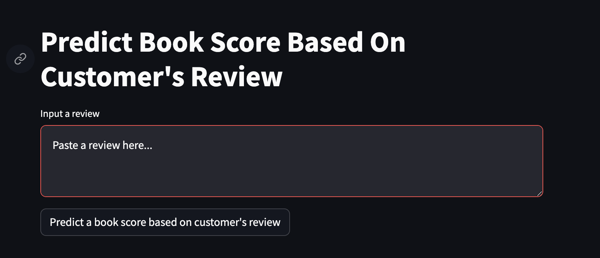
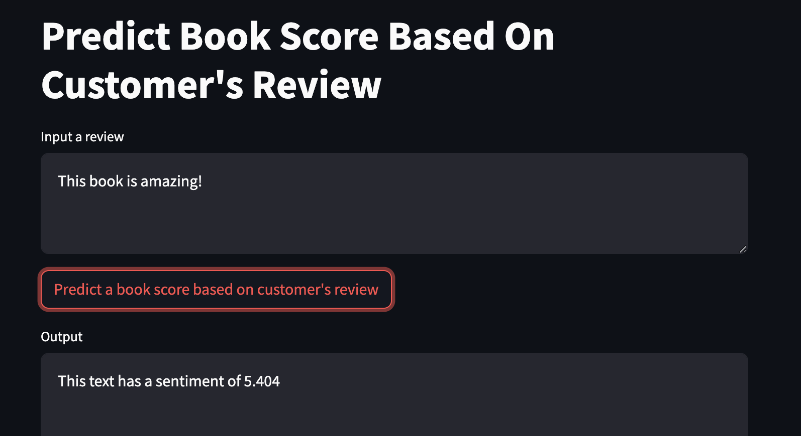

## 1. **Introduction**

E-commerce thrives on customer feedback, with reviews often being a critical factor in consumer purchasing decisions. In this project, we focus on Amazon book reviews, a rich dataset obtained from [Kaggle](https://www.kaggle.com/datasets/mohamedbakhet/amazon-books-reviews), which consists of over 50k reviews on books collected from May 1996 to July 2014. By developing a machine learning model to predict review scores from the review text, we aim to translate qualitative feedback into quantitative data. This approach will not only provide an automated insight into customer sentiment but also help businesses to better understand and respond to their audience's needs.

## 2. **Project Documentation**
   - **Design Document:**
     - In addressing the prediction of Amazon book review scores, we will employ a regression analysis method. This approach is apt for our objective because the review scores are ordinal, ranging from 1 to 5, indicating an inherent order rather than discrete, unrelated categories. Regression allows us to capture the subtle nuances and the continuum of customer sentiments expressed in the reviews, which is essential for translating qualitative text into a quantitative score. This model will thus facilitate a deeper understanding of customer feedback, enhancing business responsiveness to consumer needs.
     - Therefore, the input of the model is review text and output is predicted review score.
   - **Architecture, Losses, Metrics:**
     - We will leverage a deep learning architecture suitable for regression tasks, potentially employing a variant of BERT tailored for numerical predictions. This model will still utilize the transformer's powerful ability to understand the context in sequences of text but will be adapted to output a continuous variable—the review score—instead of class probabilities.
     - For loss function, we will employ Mean Squared Error (MSE) during training, which is standard for regression problems. MSE will measure the average squared difference between the estimated values and the actual value, providing a clear objective for the model to minimize.
     - As for performance metrics, we will assess the model also using MSE.
    - **Run Instructions:**
     - Include environment setup and command line instructions for running the notebook.

## 3. **Dataset**
   - Refer to the Jupyter Notebook `project.ipynb` for detailed procedures and analyses. The notebook contains:
     - Instructions for loading the dataset and an examination of its structure.
     - Exploratory data analysis segment to visualize the distribution of review scores and the nature of the review texts.
     - Section discussing the necessary data preprocessing steps, such as text normalization and tokenization.

## 4. **Model Training Code**
   - **Python Shell**
     - The `train.py` script contains all the necessary code for transforming review texts and conducting model training.
   - **MLFlow Project:**
     - Explore the `mlruns` directory for a detailed log of experiments, including parameters and results.

## 5. **Evaluation and Quality Assessment**
   - Model performance is rigorously assessed using Mean Squared Error (MSE), which is fitting for our regression task.
   - The optimal model was chosen based on its MSE score, alongside evaluations of runtime efficiency and model size for practical deployment.


## 6. **Service Deployment and Usage Instructions**
   - **Dockerfile or Docker-compose File:**
     - Deployment is facilitated through a Docker container, with the `Dockerfile` provided at the root of the repository..
   - **Required Services:**
     - Dependency management is streamlined with `poetry`, ensuring all necessary packages are included without the need for additional installations.
   - **Client for Service:**
     - To build and run the Docker container for the service, follow these steps:
        - Build the Docker Image:
        ```python
        docker build -t app.py .
        ```
        - Run the Docker Container:
        ```python
        docker run -p 8501:8501 app.py
        ```
   - **Access the Trained Model:**
     - With the Docker container running, open your web browser.
     - Go to `http://localhost:8501` to access the Streamlit service. This interface will provide a client to interact with the deployed model for testing and inference.

     
     

